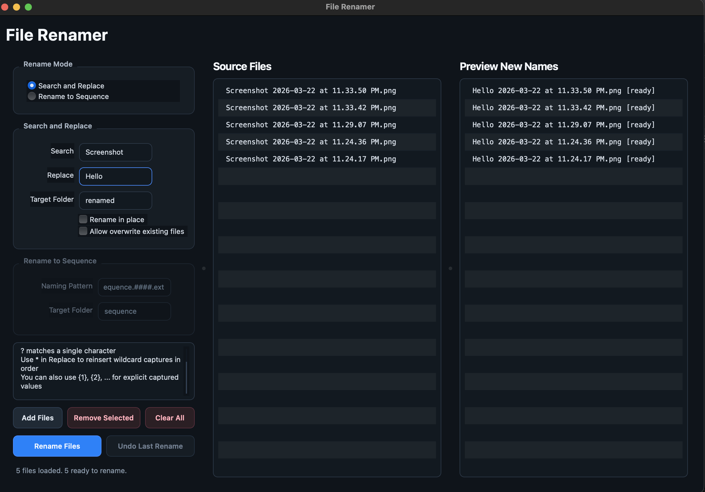

# File Renamer

Standalone desktop file renamer built with PySide6 for macOS and Windows.



## Features

- Three-column layout:
  - Left: rename controls and action buttons
  - Middle: drag and drop source files with manual reordering
  - Right: live rename preview aligned to the source list
- Dark, compact professional UI theme
- Wildcard-aware search and replace
  - `*` matches any number of characters
  - `?` matches one character
  - Use `*` in the replacement field to reinsert captured wildcard values
  - Use `{1}`, `{2}`, ... for explicit capture references
- Rename to sequence mode
  - Uses the current source list order
  - Default naming pattern: `sequence.####.ext`
  - Default target folder: `sequence`
- Rename in place or send renamed files into a target folder
- Default target folder name: `renamed`
- Optional overwrite of existing destination files
- Remembers the last successful batch and can undo it

## Run

1. Create and activate a virtual environment.
2. Install dependencies:

```bash
pip install -r requirements.txt
```

3. Launch the app:

```bash
python app.py
```

## Notes

- Search and replace is applied to the filename stem, then the original extension is kept.
- Preview updates immediately as you edit rename inputs or switch rename modes.
- Only the active rename mode section is enabled in the UI to avoid ambiguity.
- Sequence mode replaces the first run of `#` characters with a zero-padded index and maps `.ext` to the source file extension.
- When `Rename in place` is disabled, a relative target such as `renamed` is created beside each source file.
- Undo only reverts the most recent successful rename batch saved by the app.

## Packaging

For standalone builds, `PyInstaller` is the simplest path on both macOS and Windows:

```bash
pip install pyinstaller
pyinstaller --noconsole --windowed --name "File Renamer" app.py
```
